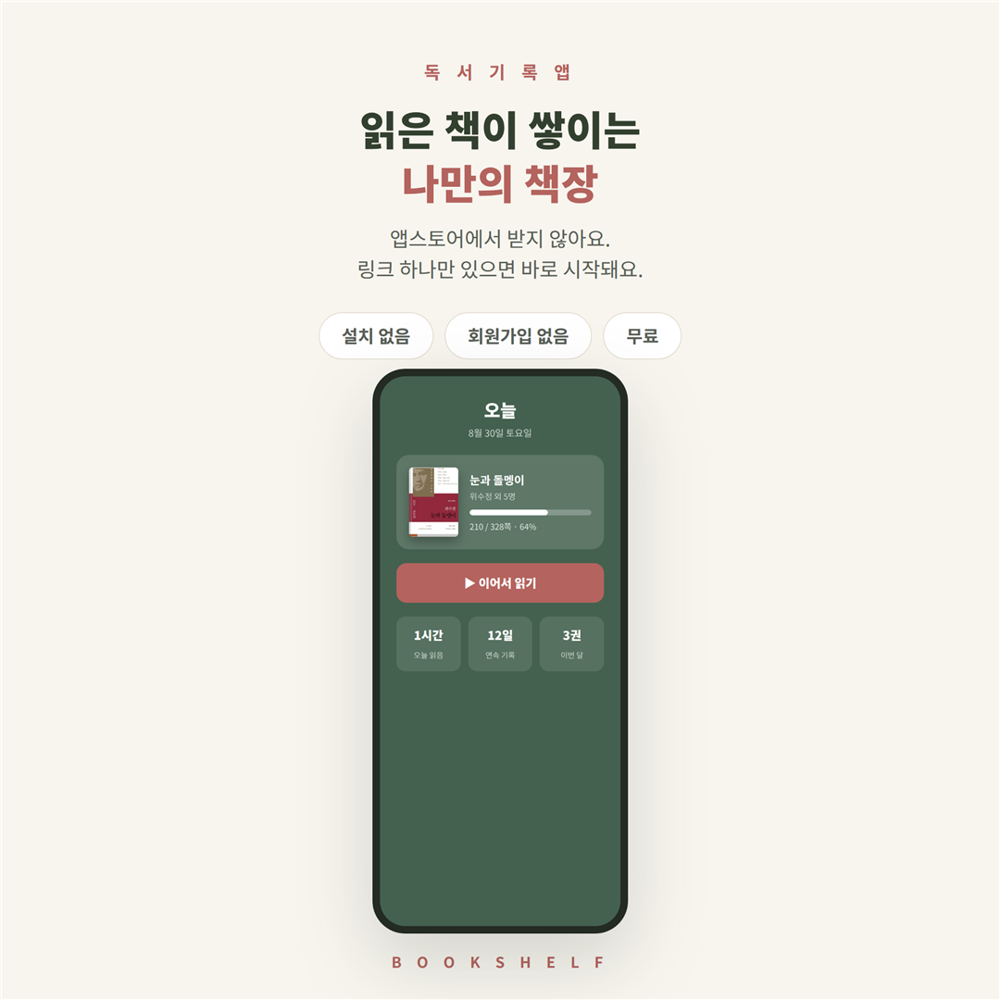
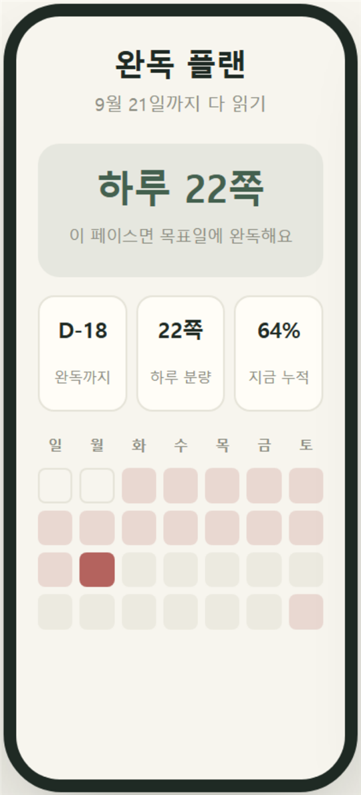
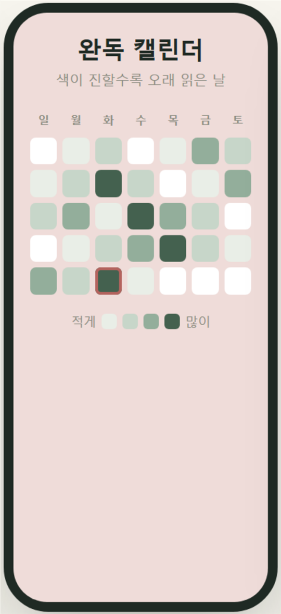
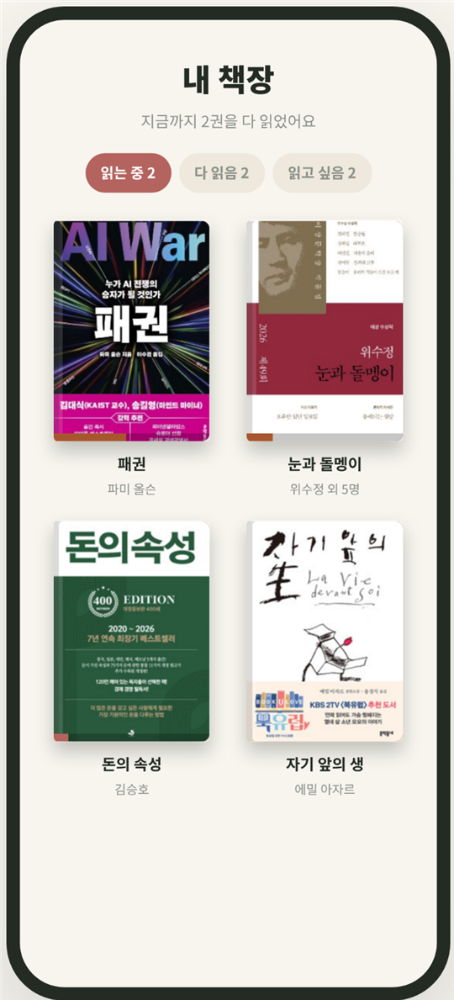

<div align="center">

# Bookshelf

[](https://github.com/growwith-jane/bookshelf)<br>
<sub>도움이 됐다면 ⭐ 하나 눌러 주세요 — 계속 만드는 데 큰 힘이 돼요.</sub>

**읽은 책이 쌓이는 나만의 책장.** · [bookshelf-eta-sable.vercel.app](https://bookshelf-eta-sable.vercel.app/)

앱스토어에서 받지 않아요. 회원가입도 없어요. 링크 하나면 시작돼요.




[시작하기](#3분이면-시작해요) · [기능](#이런-걸-할-수-있어요) · [화면](#이런-모습이에요) · [사용법](#화면별-사용법) · [백업](#기록-지키기) · [개발](#만든-방법)

</div>

---

## 어떤 앱인가요

책 읽는 사람을 위한 **독서 기록 앱**이에요.

읽은 시간을 재고, 몇 쪽까지 읽었는지 남기고, 다 읽은 날을 달력에 쌓아요. 목표일을 정하면 하루에 몇 쪽씩 읽어야 하는지 알아서 나눠주고, 못 읽은 날이 생기면 남은 날에 다시 나눠줘요.

**기록은 내 폰 안에만 있어요.** 서버에 올라가지 않아서 다른 사람이 볼 수 없고, 로그인도 필요 없어요. 대신 폰을 바꾸거나 브라우저 기록을 지우면 사라지니 [백업](#기록-지키기)을 가끔 받아두세요.

## 이런 걸 할 수 있어요

| | |
|---|---|
| ⏱ **독서 타이머** | 책 펼칠 때 켜두면 오늘 얼마나 읽었는지 저절로 남아요. 끄면서 몇 쪽까지 읽었는지만 적으면 돼요. |
| 📅 **완독 플랜** | 목표일을 정하면 하루 몫을 자동으로 나눠요. **못 읽고 넘어간 날이 생기면 목표일은 그대로 두고 남은 날에 다시 나눠줘요.** 날짜 칸마다 그날 읽을 쪽수가 적혀 있어요. |
| 🔍 **책 검색** | 제목만 치면 표지 · 저자 · 출판사 · 쪽수가 자동으로 채워져요 (알라딘 도서 DB). 검색에 없는 책은 직접 적어도 돼요. |
| ▦ **완독 캘린더** | 읽은 날이 달력에 색으로 쌓여요. 오래 읽은 날일수록 진해져서, 이번 달 흐름이 한눈에 보여요. |
| 🏅 **완독 인증 카드** | 다 읽으면 완독 도장이 찍힌 카드가 나와요. 이미지로 저장해서 공유할 수 있어요. |
| ✍️ **문장 남기기** | 마음에 닿은 문장을 쪽수와 함께 남겨요. 한 권에 여러 개 남길 수 있고, 나중에 고치거나 지울 수 있어요. |
| 🏷 **분야 · 별점 · 한 줄평** | 책마다 분야를 골라두면 나중에 어떤 쪽을 많이 읽었는지 볼 수 있어요. 별점과 한 줄평도 남길 수 있고요. |
| 💾 **기록 백업** | 지금까지의 기록을 파일 하나로 내보내고, 새 폰에서 그대로 불러와요. |
| 🔒 **나만 봐요** | 계정 없음, 광고 없음, 서버 저장 없음. 기록은 이 브라우저 안에만 있어요. |

## 이런 모습이에요

<table>
<tr>
<td width="33%" valign="top"><br><sub><b>완독 플랜</b> — 목표일을 정하면 하루 몫이 자동으로 나뉘어요</sub></td>
<td width="33%" valign="top"><br><sub><b>완독 캘린더</b> — 오래 읽은 날일수록 진하게</sub></td>
<td width="33%" valign="top"><br><sub><b>내 책장</b> — 제목만 검색하면 표지가 꽂혀요</sub></td>
</tr>
</table>

## 3분이면 시작해요

**1. 링크를 눌러요**

[bookshelf-eta-sable.vercel.app](https://bookshelf-eta-sable.vercel.app/) — 설치도 회원가입도 없어요.

**2. 홈 화면에 추가해요** (이 단계를 꼭 해주세요)

폰 첫 화면에 아이콘이 생겨서 다음부터는 앱처럼 바로 열려요.

| 기종 | 방법 |
|---|---|
| 아이폰 (사파리) | 아래쪽 가운데 **공유 버튼** → 메뉴를 내려서 **홈 화면에 추가** → 오른쪽 위 **추가** |
| 안드로이드 (크롬) | 오른쪽 위 **점 세 개** → **홈 화면에 추가** → **설치** 또는 **추가** |

> **메뉴가 안 보인다면** — 카톡 안에서 열면 이 메뉴가 없어요. 오른쪽 아래 버튼으로 **사파리나 크롬으로 열기**를 먼저 해주세요. 카톡 안에서 쓰면 기록도 거기에만 쌓여서, 나중에 사파리로 열면 빈 책장으로 보여요.

**3. 읽고 있는 책을 담아요**

**책장** → **책 등록하기** → 제목을 치면 나머지는 알아서 채워져요.

## 화면별 사용법

화면은 네 개예요.

| 화면 | 하는 일 |
|---|---|
| **오늘** | 지금 읽는 책, 오늘 몫, 타이머. 맨 위 표지를 누르면 그 책 상세로 가요 |
| **캘린더** | 읽은 날이 색으로 쌓인 달력 |
| **책장** | 읽는 중 · 다 읽음 · 읽고 싶음으로 나뉜 내 책들 |
| **설정** | 백업, 사용법, 업데이트 소식 |

### 읽기

| 동작 | 방법 |
|---|---|
| 읽기 시작 | **오늘** 화면의 `▶ 읽기 시작` — 책을 펼칠 때 눌러요 |
| 읽기 끝 | 타이머에서 종료 → **몇 쪽까지 읽었는지** 입력 |
| 완독 처리 | 마지막 쪽까지 입력하면 자동, 또는 책 상세에서 `완독 처리` |

### 책 상세에서

| 동작 | 방법 |
|---|---|
| 목표일 정하기 | `목표일 정하기` — 하루 몫이 자동으로 나뉘어요 |
| 문장 남기기 | `문장 남기기` — 문장과 쪽수를 적어요. 남긴 뒤에도 `고치기` · `지우기` |
| 분야 고르기 | `정보 수정` → 분야 |
| 별점 · 한 줄평 | 별을 누르고, `한 줄평 쓰기` |
| 완독 카드 보기 | 다 읽은 책에서 `인증 카드 보기` → `이미지로 저장하기` |

## 기록 지키기

기록은 **이 브라우저 안에만** 저장돼요. 서버에 올라가지 않아서 나만 볼 수 있는 대신, 폰을 바꾸거나 브라우저 기록을 지우면 사라져요.

| | |
|---|---|
| **내보내기** | 설정 → `기록 내보내기` → `독서기록_날짜.json` 파일 하나로 저장돼요 |
| **불러오기** | 새 폰에서 설정 → `기록 불러오기` → 그 파일을 고르면 책장이 그대로 돌아와요 |

> 내보낸 파일은 카톡으로 나에게 보내두거나 메일에 첨부해 두면 안전해요.
> **폰을 바꾸기 전 · 브라우저 정리 전 · 한 달에 한 번쯤** 받아두시면 좋아요.

## 만든 방법

**화면 전체가 `index.html` 파일 하나**예요. 외부 라이브러리를 쓰지 않았고, 빌드 과정도 없어요.

```
index.html              앱 전체 (화면 · 기능 · 스타일)
api/book.js             알라딘 도서 검색 중계 (Vercel 서버리스 함수)
manifest.webmanifest    홈 화면에 추가했을 때의 아이콘 · 이름
icon.png                앱 아이콘
```

| | |
|---|---|
| **화면** | 바닐라 JavaScript. 프레임워크 없음, 빌드 없음 |
| **저장** | 브라우저 `localStorage`. 책 · 독서 기록 · 문장이 모두 여기에 |
| **책 검색** | `/api/book` 이 알라딘 OpenAPI 를 중계해요. 키는 코드가 아니라 Vercel 환경변수 `ALADIN_TTB_KEY` 에 있어요 |
| **배포** | GitHub 에 올리면 Vercel 이 자동으로 반영해요 |
| **완독 카드** | Canvas 로 그려서 PNG 로 저장. 화면 카드와 저장 이미지는 같은 모양이 되도록 표지 크기를 기준으로 맞췄어요 |

### 직접 돌려보려면

```bash
git clone https://github.com/growwith-jane/bookshelf.git
cd bookshelf
```

`index.html` 을 브라우저로 열면 바로 동작해요. 다만 **책 검색은 서버가 필요해서** 파일로 열면 작동하지 않아요 (제목 · 쪽수를 직접 입력하는 건 그대로 됩니다). 검색까지 보려면 Vercel 에 올리고 환경변수 `ALADIN_TTB_KEY` 에 [알라딘 OpenAPI](https://www.aladin.co.kr/ttb/wblog_manage.aspx) 키를 넣어주세요.

### 색

| 자리 | 색 |
|---|---|
| 기본 초록 | `#44614F` |
| 포인트 로즈 | `#B4635E` |
| 바탕 | `#F7F5EE` |
| 카드 | `#FFFDF7` |
| 글자 | `#1F2A24` |

탭마다 화면 배경이 바뀌어요 — 오늘은 딥그린, 캘린더는 소프트로즈, 책장과 설정은 아이보리.

---

<div align="center">
<sub>도서 정보 제공 · <a href="https://www.aladin.co.kr">알라딘 인터넷서점</a></sub>
</div>
